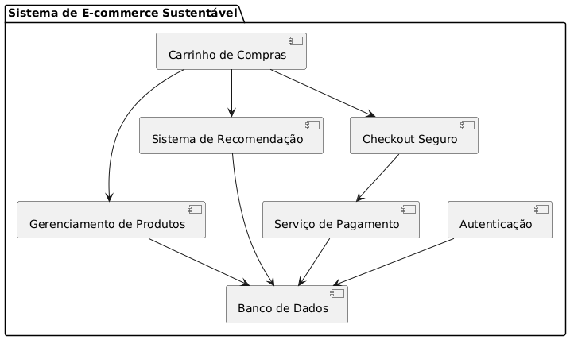
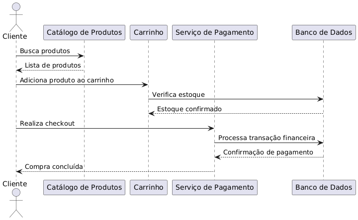
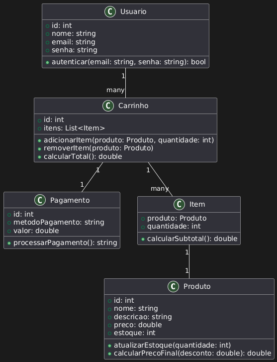

# Proposta Arquitetural

## 1. Introdução
Este documento descreve a proposta arquitetural para o sistema de e-commerce sustentável, destacando os principais componentes, diagramas UML e justificativas para as decisões tomadas.

## 2. Arquitetura Escolhida: Microservices
- Modularidade, escalabilidade e isolamento de falhas.
- Serviços principais:
  - **Gerenciamento de Produtos**.
  - **Autenticação e Usuários**.
  - **Carrinho de Compras**.
  - **Sistema de Recomendação**.
  - **Pagamentos**.

## 3. Diagramas UML
### Diagrama de Componentes

### Diagrama de Sequência

### Diagrama de Classes

